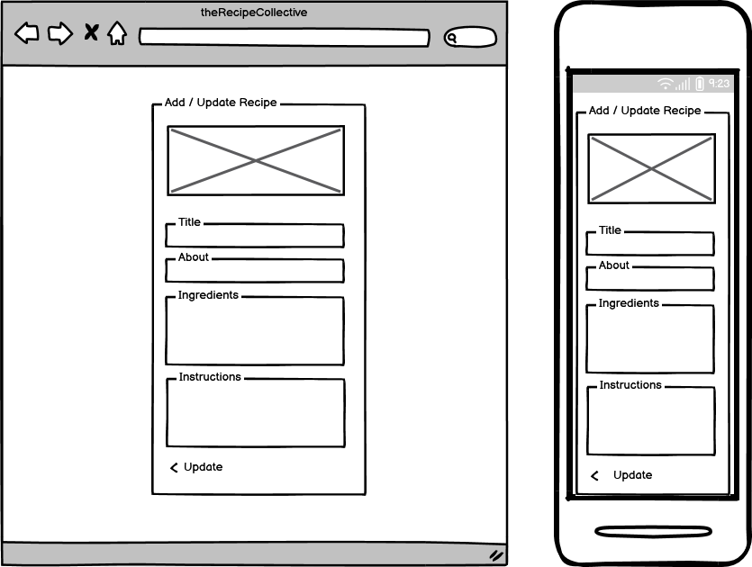
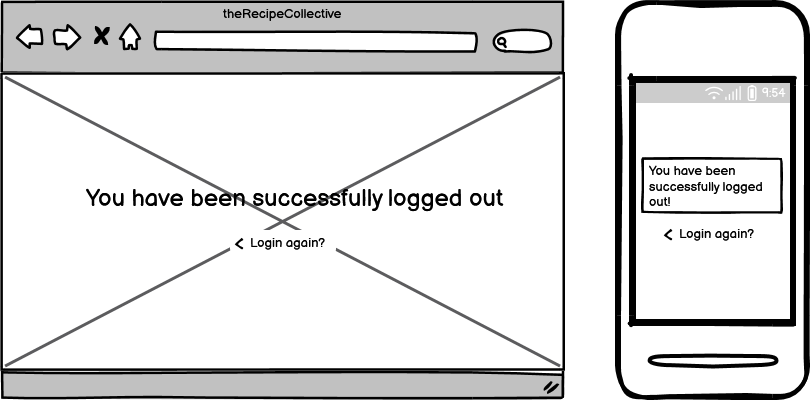

README

# the Recipe Collective

Are you tired of endless recipe searches, scrolling through pages of uninspiring dishes? Look no further than The Recipe Collective! Our community-driven platform offers a smorgasbord of culinary inspiration, from mouth-watering mains to decadent desserts. Whether you're a seasoned chef or a kitchen novice, we've got something to whet your appetite. Plus, with features like comments and likes, you can connect with fellow foodies and get feedback on your latest creations. 

So why settle for the same old boring meals? Join The Recipe Collective and spice up your kitchen game!

Developer: Sandra Bergström  
[Live webpage](https://the-recipe-collective.herokuapp.com/)

## Table of Content

1. [Project Goals](#project-goals)
    1. [User Goals](#user-goals)
    2. [Site Owner Goals](#site-owner-goals)
2. [User Experience](#user-experience)
    1. [Target Audience](#target-audience)
    2. [User Requirements and Expectations](#user-requirements-and-expectations)
    3. [User Stories](#user-stories)
3. [Database](#database)
    1. [User App](#user-app)
    2. [Cookbook App](#cookbook-app)
4. [Design](#design)
    1. [Design Choices](#design-choices)
    2. [Colour](#colours)
    3. [Fonts](#fonts)
    4. [Structure](#structure)
    5. [Wireframes](#wireframes)
5. [Technologies Used](#technologies-used)
    1. [Languages](#languages)
    2. [Frameworks](#frameworks)
    3. [Database](#database)
    4. [Tools](#tools)
    5. [Supporting Libraries and Packages](#supporting-libraries-and-packages)
6. [Methodology](#methodology)
    1. [Agile Project Management with GitHub Projects](#agile-project-management-with-github-projects)
    2. [User Stories as GitHub Issues](#user-stories-as-github-issues)
    3. [Bug Tracking](#bug-tracking)
    4. [Iterative Development Approach](#iterative-development-approach)
    5. [Backlog and Subsequent Iterations](#backlog-and-subsequent-iterations)
7. [Features](#features)
    1. [Landing Page](#landing-page)
    2. [Cookbook Pages](#cookbook-pages)
    3. [Recipe Pages](#recipe-pages)
    4. [User Account Management](#user-account-management)
    5. [Recipe Management](#recipe-management)
    6. [Navigation](#navigation)
    7. [Future Features](#future-features)
8. [Testing](#validation)
9. [Bugs](#bugs)
    1. [Known bugs](#known-bugs)
    2. [Fixed bugs](#fixed-bugs)
10. [Deployment](#deployment)
11. [Credits](#credits)
12. [Acknowledgements](#acknowledgements)

## Project Goals 
The Recipe Collective is a web application designed to provide users with a platform to discover, save, and organize recipes. The goals of the project include:

- Providing a user-friendly interface for users to browse and explore a collection of recipes.
- Allowing users to save their favorite recipes for easy access.
- Offering users the ability to upload and manage their own recipes within their personal cookbook.
- Facilitating the creation of a personal cookbook with three sections: the Collective's Recipes, User's Uploaded Recipes, and Favorite Recipes.
- Promoting culinary inspiration and sharing by enabling users to discover a variety of recipes from different cuisines and categories.

### User Goals
- Exploring and browsing a curated collection of recipes.
- Saving recipes to their personal cookbook for future reference.
- Uploading and managing their own recipes within their personal cookbook.
- Accessing their personal cookbook, which includes three sections: the Collective's Recipes, User's Uploaded Recipes, and Favorite Recipes.
- Finding culinary inspiration by discovering recipes from various cuisines, continents and categories.
- Engaging with the community by adding comments and sharing feedback on recipes.

### Site Owner Goals
- Providing a platform for users to discover, save, and organize recipes.
- Offering users the ability to upload and manage their own recipes.
- Enhancing user experience by curating a collection of diverse and appealing recipes.
- Encouraging users to engage with the site, share their culinary creations, and participate in discussions through comments.

[Back up](#table-of-content)

## User Experience

### Target Audience
The Recipe Collective caters to the following target audience:

- Cooking enthusiasts and food lovers seeking culinary inspiration.
- Individuals interested in discovering recipes from various cuisines, continents, and categories.
- Users who have recipes scattered across different platforms and desire a centralized location to store and organize them.
- Individuals who want a convenient and user-friendly platform to store and manage their personal recipe collection.
- Users who wish to easily share their favorite recipes with friends and family.

By providing a seamless recipe storage and sharing experience, the Recipe Collective aims to simplify the process of organizing and accessing recipes, creating a go-to resource for home cooks and food enthusiasts alike.

### User Requirements and Expectations
When using the Recipe Collective, users can expect the following features and characteristics to meet their requirements:

- A user-friendly interface that allows for intuitive navigation and easy recipe browsing.
- High-quality recipe presentation, including clear instructions, ingredients, and visuals.
- Responsive design that ensures a visually appealing experience on different devices.
- Personalized features, such as a user cookbook to store favorite recipes, track personal creations, and add comments to recipes.
- Access to a diverse collection of recipes, offering inspiration for everyday meals and special occasions.

The Recipe Collective strives to create an enjoyable and engaging environment for users to explore, discover, and share their love for cooking and delicious recipes.

### User Stories

#### Epic 1: User Authentication and Account Management

- [As a First Time User, I can create an account so that I can save my recipes](https://github.com/SandraBergstrom/theRecipeCollective/issues/3#issue-1676151139) 
- [As a Returning User, I can log in/out of my account so that I can access my saved recipes securely](https://github.com/SandraBergstrom/theRecipeCollective/issues/4#issue-1676185860) 
- [As a Returning User, I can go to my profile page so that I can see my saved recipes and personal information](https://github.com/SandraBergstrom/theRecipeCollective/issues/12#issue-1676233050) 
- [As a Site Owner, I can view and manage user accounts to ensure the security and integrity of the site and its users](https://github.com/SandraBergstrom/theRecipeCollective/issues/1#issue-1676139643)

#### Epic 2: Recipe Management
- [As a Returning User, I can view all recipes so that I can find new recipes to try](https://github.com/SandraBergstrom/theRecipeCollective/issues/2#issue-1676140284) 
- [As a Returning User, I can click on a recipe so that I can get all details and instructions about it](https://github.com/SandraBergstrom/theRecipeCollective/issues/6#issue-1676195459) 
- [As a Returning User, I can save recipes that I find in my own "cookbook" so that I can find them easily in the future](https://github.com/SandraBergstrom/theRecipeCollective/issues/17#issue-1676239448) 
- [As a Returning User, I can add a new recipe so that I can share it with others and save it for myself](https://github.com/SandraBergstrom/theRecipeCollective/issues/5#issue-1676191345) 
- [As a Returning User, I can edit my own recipes so that I can update them if needed](https://github.com/SandraBergstrom/theRecipeCollective/issues/7#issue-1676198620) 
- [As a Returning User, I can delete my own recipe so that I can remove them if wanted](https://github.com/SandraBergstrom/theRecipeCollective/issues/8#issue-1676201972) 
- [As a Returning User I can comment on a recipe so that share my thoughts and suggestions](https://github.com/SandraBergstrom/theRecipeCollective/issues/11) 
- [As a Site Owner, I can view and manage recipes to maintain a high standard of content and ensure the quality of the recipes on the site](https://github.com/SandraBergstrom/theRecipeCollective/issues/1#issue-1676139643) 

#### Epic 3: User Experience and Site Information
- [As a First Time User, I want to be able to access the About page so that I can learn more about the purpose, features, and benefits of the Recipe Collective without needing to create an account](https://github.com/SandraBergstrom/theRecipeCollective/issues/37#issue-1708609060) 
- [As a Returning User, I want to be able to navigate through a long list of recipes using pagination so that I can view and interact with the list easily](https://github.com/SandraBergstrom/theRecipeCollective/issues/21#issue-1688404118) 

[Back up](#table-of-content)

## Database
The Recipe Collective utilizes the following database schema:

See Database Schema

### User App
- Profile model that extends the User model to add additional fields like image, food_relation, and country to store user-specific information.
- The Profile model is linked to the default Django User model using a one-to-one relationship.
- CloudinaryField from the cloudinary.models module to store the user's image with cloud-based hosting.

### Cookbook App
- Recipe model in the Cookbook app represents a recipe that users can create, view, update, and delete.
- Fields include title, author (linked to the Django User model), featured_image, excerpt, about, category, prep_time, cooking_time, servings, ingredients, instructions, date_posted, date_updated, and status.
- The favorites field establishes a many-to-many relationship with the User model, allowing users to save recipes as favorites.
- A FavoriteManager is implemented to retrieve recipes that are marked as favorites by a specific user.
- Comment model is added to represent a comment on a recipe. It has a many-to-one relationship with the recipe model, linking each comment to the recipe it belongs to. 

[Back up](#table-of-content)

## Design
At the Recipe Collective, the design philosophy revolves around creating a clean and modern user interface that puts the spotlight on the recipes themselves. Taking inspiration from modern home kitchens, the aim is to provide a visually pleasing and immersive experience for users, where they can easily navigate, discover, and engage with a vast collection of recipes.

By adopting a minimalistic design approach, we strive to eliminate distractions and ensure that the focus remains on the culinary creations shared within the community. The use of ample white space, intuitive layouts, and crisp typography enhances readability and allows the vibrant colors and mouthwatering imagery of the recipes to take center stage.

### Design Choices
One of the key design choices we made was to prioritize a light and clean aesthetic throughout the Recipe Collective. This deliberate approach aims to enhance the presentation of recipe images and create an inviting atmosphere for users to immerse themselves in the content. To achieve this, I meticulously curated a color scheme that exudes freshness while incorporating subtle hints of color that resonate with the culinary nature of our application.

### Colour
One of the key design choices we made was to keep the overall aesthetic light and clean. This approach enhances the recipe images and creates an inviting atmosphere for users to explore and engage with the content. We carefully selected a color scheme that evokes a sense of freshness with a tiny bit of color to reflect the culinary nature of our application.

### Fonts
The Recipe Collective embraces the default fonts provided by Bootsrap 5. No specific modifications have been made to the default fonts, as they effectively contribute to the overall aesthetic and user experience of the Recipe Collective.

### Structure
The Recipe Collective is designed with a user-friendly and intuitive structure, making it easy for users to navigate and learn their way around the website. The overall structure of the website is organized into the following sections and pages:

#### Before Logged In:

- **Landing Page** The landing page serves as the initial entry point to the website, providing an introduction and overview of the Recipe Collective's purpose and features. 
- **About Page:** The about page provides detailed information about the Recipe Collective, including its mission, values, and the benefits of being a part of the community. 
- **Sign Up Page:** The sign-up page allows new users to create an account by providing their required details and registering as a member of the Recipe Collective. 
- **Login Page:** The login page is where registered users can securely log in to access their accounts and the full functionality of the website. 

#### When Logged In:
Upon logging in, users are directed to the main cookbook section of the Recipe Collective, which includes the following pages:

- **Home Page (Cookbook):** The home page of the cookbook section serves as the central hub, displaying a personalized collection of recipes based on the user's preferences, saved recipes, and recent activities within the community. 
- **My Recipes Page:** The "My Recipes" page allows users to view and manage the recipes they have created and contributed to the Recipe Collective. It provides options to edit, delete, and organize recipes for easy access and retrieval. 
- **My Favorites:** The "My Favorites" page displays a curated list of recipes that the user has marked as favorites, making it convenient to revisit and cook their preferred dishes.
- **Recipe Detail Page:** The recipe detail page provides comprehensive information about each recipe, including its title, description, ingredients, and instructions. Users have the option to add the recipe to their favorites, allowing them to easily revisit and cook their preferred dishes. Additionally, if the recipe belongs to the user, they can update or delete it, empowering them to manage their own recipes. Furthermore, users can engage with the recipe by leaving comments, sharing their thoughts, suggestions, and feedback with the community. This fosters interaction and allows users to exchange culinary ideas and experiences. 

#### Profile Navigation:
Upon clicking on the profile image in the navigation bar, additional links are revealed, providing access to specific profile-related pages and actions:

- **Profile Page:** The profile page displays the user's profile information, including their bio, profile picture, and other relevant details. It allows users to update and customize their profile settings. 
- **Add Recipe Page:** The "Add Recipe" page enables users to contribute their own recipes to the Recipe Collective. It provides a user-friendly form to input recipe details, including title, description, ingredients, instructions, and other relevant information. 
- **My Recipes:** The "My Recipes" page allows users to view and manage the recipes they have created and contributed to the Recipe Collective. It provides options to edit, delete, and organize recipes for easy access and retrieval. 
- **Favorite Recipes:** The "My Favorites" page displays a curated list of recipes that the user has marked as favorites, making it convenient to revisit and cook their preferred dishes. 
- **Logout:** The "Logout" option allows users to securely log out of their accounts, ensuring the privacy and security of their personal information. 

The structured design of the Recipe Collective ensures a seamless and enjoyable user experience, enabling users to explore, contribute, and manage their recipes with ease.

### Wireframes
The wireframes provide a visual representation of the different pages and features of the web application. They serve as a blueprint for the design and layout of each page, helping to visualize the user interface and overall user experience. These wireframes were created using Balsamiq, a tool that enables quick and intuitive sketching of design ideas.

Log in (landing page)

About

Sign Up

The Collective Cookbook

My Recipes

My Favorites

Add/Update Recipe

Recipe Detail

Profile

Logout

 

[Back up](#table-of-content)

## Technologies Used

### Languages
- HTML
- CSS
- Python

### Frameworks
- Django: A high-level Python web framework used for building the Recipe Collective website.
- Crispy Forms: A Django package used for rendering forms in a more efficient and customizable way.
- Bootstrap v5.0: A popular CSS framework used for creating responsive and visually appealing user interfaces.
- Materialize: A modern responsive CSS framework that provides ready-to-use components and styles for building user interfaces in the Recipe Collective project.
- Cloudinary: A cloud-based media management platform used for storing and serving images in the Recipe Collective project.

### Database
- ElephantSQL: ElephantSQL is a PostgreSQL database as a service. It is used as the database for the Recipe Collective project, providing a reliable and scalable storage solution for the application's data.

### Tools
- Git: A distributed version control system used for tracking changes in the project's source code.
- GitHub: A web-based hosting service for version control repositories, used for storing and managing the project's source code.
- Gitpod: An online integrated development environment (IDE) used for developing and testing the Recipe Collective project.
- Heroku: A cloud platform that enables deployment and hosting of web applications. Heroku was used for deploying the Recipe Collective project to a live server.
- Adobe Photoshop: A professional image editing software used for advanced image manipulation and design in the Recipe Collective project.
- Balsamiq: A wireframing tool used for creating mockups and prototypes of the Recipe Collective website.
- Lucidchart: Lucidchart is a web-based diagramming tool that offers a wide range of diagramming capabilities, including ER diagrams. It provides an intuitive interface and collaboration features, making it suitable for both individual and team use.
- Google Fonts: A collection of free and open-source fonts used for typography on the Recipe Collective website.
- Font Awesome: A library of icons used for adding scalable vector icons to the Recipe Collective website.

### Supporting Libraries and Packages
- asgiref==3.6.0: ASGI specification reference implementation for Django.
- cloudinary==1.32.0: Python SDK for integrating Cloudinary into Django applications.
- crispy-bootstrap5==0.7: A Django app that adds crispy-forms support to Bootstrap 5.
- dj-database-url==0.5.0: A Django utility for utilizing 12factor inspired DATABASE_URL environment variables.
- dj3-cloudinary-storage==0.0.6: A Django package that provides Cloudinary storage for Django applications.
- django-crispy-forms==2.0: A Django package that helps you manage Django forms in a DRY way.
- gunicorn==20.1.0: A Python WSGI HTTP server for UNIX, commonly used for deploying Django applications.
- psycopg2==2.9.6: PostgreSQL adapter for Python, used for connecting Django to a PostgreSQL database.
- pytz==2023.3: A Python library that provides timezone support.
- sqlparse==0.4.4: A non-validating SQL parser for Python, used by Django for SQL query parsing.
- requests==2.26.0: A Python library for making HTTP requests, often used in Django projects for external API integrations.

[Back up](#table-of-content)

## Methodology
The Recipe Collective project has been developed using agile principles, enabling efficient collaboration, iterative development, and effective project management. The following methodology has been employed throughout the project:

### Agile Project Management with GitHub Projects
GitHub Projects has been utilized to facilitate agile project management. User stories and bugs have been organized as GitHub issues, allowing for a clear and structured approach to development. The project board in GitHub Projects serves as a Kanban board, providing an overview of the project's progress.

### User Stories as GitHub Issues
Each user story has been created as a GitHub issue, capturing the desired functionality from the user's perspective. The user stories are linked to their corresponding GitHub issues, allowing easy access to the acceptance criteria, tasks, and comments associated with each user story.

### Bug Tracking
Bugs encountered during the development process have also been logged as GitHub issues. These issues contain details about the specific bug, its impact, and steps to reproduce it. By linking the bugs in the README.md to their respective GitHub issues, users can gain insights into the bugs' resolution progress and view any additional comments.

### Iterative Development Approach
The Recipe Collective project adopts an iterative development approach, allowing for continuous improvement and progress within the given time constraints. Although the project timeline has been condensed, it has been structured to accommodate future iterations and enhancements.

### Backlog and Subsequent Iterations 
The user stories are tracked on the project board, and the "To do" column represents the backlog of user stories, indicating the tasks that will be addressed in subsequent iterations.

Please note that even though the project timeline has been accelerated, the iterative development approach allows for ongoing improvements and enhancements to meet the evolving needs of users.

For a comprehensive view of the project progress, user stories, and bug tracking, please see the [Kanban board](https://github.com/users/SandraBergstrom/projects/6).

[Back up](#table-of-content)

## Features
### Landing Page:
- The landing page serves as the entry point to the Recipe Collective, providing a short introduction and overview of the platform and have clear buttons to the Sign up page as well as the Login page.

See Screenshot

- Users can easily navigate to different sections available for unauthorized users of the website through the navigation bar. 

See Screenshot

### Cookbook Pages:
- When the user has logged in they will be directed to the Collective Cookbook where they can scroll recipe cards. 

See Screenshot

- The user can 

### Recipe Pages:
- Recipe details page displays comprehensive information about each recipe, including ingredients, instructions, and cooking time. 

See Screenshot

- Users can add the recipe to the favorites by clicking the heart icon and will get a confirmation message to give them information that the recipe was added. 

See Screenshot

  

- Likewise the user can easily remove a recipe from their favorites by clicking the heart icon again. 

See Screenshot

- Users can engage with recipes by leaving comments, sharing their thoughts, suggestions, and feedback with the community. 

See Screenshot

### User Account Management:
- Account sign-up form allows new users to create an account and join the Recipe Collective community. The form has validation to make sure that the user enters the correct information needed. Such validation is: 
    - username required and has a maximum of 150 characters or fewer. Letters, digits and @/./+/-/_ only.
    - email required and has to be an email
    - password has the following constraints:
        - can’t be too similar to your other personal information.
        - must contain at least 8 characters.
        - can’t be a commonly used password.
        - can’t be entirely numeric.
    - password confirmation
    

See Screenshot

- When successfully created an account the user will get confirmation and be asked to log in.

See Screenshot

- Users can log in to their accounts to access personalized features and settings

See Screenshot

- Profile page enables users to view and update their profile information.

See Screenshot

- When user has updated their profile they will get a messgage confirming the update.

See Screenshot

### Recipe Management:
- Recipe creators can add (from profile section), edit, and delete recipes from their profile. 

See Screenshot

- Comprehensive forms facilitate easy recipe submission and editing. 

See Screenshot

### Navigation:
- The navigation bar provides easy access to different sections and pages of the Recipe Collective and adapts based on the user's authorization status, providing different options for unauthorized and authorized users.

- On smaller screens, the navigation bar collapses into a burger menu, allowing for a compact and mobile-friendly navigation experience. Users can access the menu by clicking on the burger icon, which reveals the navigation options in a dropdown fashion.

#### Unauthorized users
- When unauthorized, the navigation bar displays links to "About," "Sign up," and "Login. 

See Screenshot

- On smaller screens, the navigation bar collapses into a burger menu, allowing for a compact and mobile-friendly navigation experience. Users can access the menu by clicking on the burger icon, which reveals the navigation options in a dropdown fashion. 

See Screenshot

#### Unauthorized users
- Once authorized, the navigation bar updates to include links to "About" and "Cookbook." 

See Screenshot

 

- On the right side, it displays a round profile image with a collapsible navigation menu, which includes options such as "Profile page," "Add recipe," "My Recipes," "Favorite recipes," and "Logout. 

See Screenshot

- On smaller screens, the navigation bar on the lef collapses into a burger menu, allowing for a compact and mobile-friendly navigation experience. Users can access the menu by clicking on the burger icon, which reveals the navigation options in a dropdown fashion. 

See Screenshot

The Recipe Collective focuses on providing a clean and user-friendly design, with a focus on the recipes themselves. It emphasizes CRUD functionality, allowing users to create, read, update, and delete recipes as they contribute to the culinary community. The platform aims to inspire and facilitate the sharing of delicious recipes among users.

### Future Features

-  

[Back up](#table-of-content)

## Testing
The Recipe Collective website underwent thorough testing to ensure its functionality, accessibility, and performance. The testing process involved code validation, accessibility assessment, performance evaluation, testing on various devices, browser compatibility checks, testing user stories, and incorporating user feedback for improvements.

To view the complete testing details and results, please [click here](TESTING.md).

[Back up](#table-of-content)

## Bugs

### Known bugs

| **Bug** | **Status** |
| ----------- | ----------- |
| [I can't get the active link to show. I use active class according to bootstrap but it will not change when I go to another page.](https://github.com/SandraBergstrom/theRecipeCollective/issues/30)| [See update here](https://github.com/SandraBergstrom/theRecipeCollective/issues/30#issuecomment-1554147835) |
|||

### Fixed bugs 

| **Bug** | **Fix** |
| ----------- | ----------- |
|[If there is less than 3 recipe cards it will not look good any longer. The cards get slimmer and the page layout get strange when only 1 card.](https://github.com/SandraBergstrom/theRecipeCollective/issues/36)|The problem seems to have been a fixed height on the .card-img-top. I have now changed it to keep an image ratio of 1:1 widht a full widht.|
|[Prep time and cooking time is showing seconds and not minutes.](https://github.com/SandraBergstrom/theRecipeCollective/issues/23)|Changed from DurationField to PositiveIntegerField.   [See detailed steps](https://github.com/SandraBergstrom/theRecipeCollective/issues/23#issuecomment-1549336886)|
|[Cant delete users from admin page](https://github.com/SandraBergstrom/theRecipeCollective/issues/35)|High priority: Because of an old field in one of the models. Will change database to a clean before deploy.|
|[Error message E-tag when deploying to Heroku. Temporary solves when I remove the static folder in Cloudinary. But that also removes all profile pictures and recipe images.](https://github.com/SandraBergstrom/theRecipeCollective/issues/32)|Before deploying on Heroku the static folder in Cloudinary have to be removed. This wiill not remove recipe or profile images.|
|[Heart icon does not show as saved (solid) when recipe is saved to favorites.](https://github.com/SandraBergstrom/theRecipeCollective/issues/28)|Temporary solution - removed it from the recipe card.  Low priority: Since we have a functioning heart icon in the recipe details for users to save them to favorites, this is of low priority and can be addressed in a future update.|
| [Default recipe pic is not showing](https://github.com/SandraBergstrom/theRecipeCollective/issues/25)| Added if statement in the detail template to show the placeholder if image is default, else show uploaded image. |
| [When trying to update a recipe with an uploade picture instead of the default placeholder, it will not update.](https://github.com/SandraBergstrom/theRecipeCollective/issues/27) | When fixing [#25](https://github.com/SandraBergstrom/theRecipeCollective/issues/25) I instead created this bug. I have now removed the if statment again. I then updated the recipe model and removed the placholder variable and instead added a placeholder image on cloudinary which I directly link to as default in the featured_image field. See more details in bug link.
|[Last updated field not working in recipe detail. It is working in the recipe card in the list so check there.](https://github.com/SandraBergstrom/theRecipeCollective/issues/22)|Corrected model field name.|
|[Default profile pic is not showing. Tried both to add a direct link to cloudinary and to store it locally.](https://github.com/SandraBergstrom/theRecipeCollective/issues/24)|In the profile model that extends the user I added a imageField instead of CloudinaryField. I switched, added a cloudinary link and problem solved.|
|[Can't connect to fontawesome](https://github.com/SandraBergstrom/theRecipeCollective/issues/26)|Installed fontawesome for bootstrap 5|
|[Food relation should be showing after username on the recipe cards, but it's not anymore. Now it's only showing the code.](https://github.com/SandraBergstrom/theRecipeCollective/issues/31)|When I use format document it creates a linebreak right after "{{" in "{{ recipe.author.profile.get_food_relation_display }}" which will create problems.|
|||

[Back up](#table-of-content)

## Deployment
The website was deployed using Heroku by following these steps:
1. Set DEBUG to False in the settings.py file.
2. Commit and push your code to the GitHub repository.
3. Clear the 'static' folder in Cloudinary to ensure the latest static files are used during deployment. This step is important to avoid any potential conflicts between cached versions of static files and the updated versions being deployed. Clearing the 'static' folder ensures that the latest versions of static files are used during the deployment process, preventing any eTag errors or inconsistencies.
4. Navigate to the project's deploy page in Heroku.
5. Choose the manual deployment option to deploy the latest code changes.

You can for fork the repository by following these steps:
1. Go to the GitHub repository
2. Click on Fork button in upper right hand corner
3. Wait for the forking process to complete. Once done, you will have a copy of the repository in your GitHub account.

You can clone the repository by following these steps:
1. Go to the GitHub repository 
2. Locate the Code button above the list of files and click it 
3. Select your preferred method for cloning: HTTPS, SSH, or GitHub CLI, and click the copy button to copy the repository URL to your clipboard.
4. Open Git Bash (or your preferred terminal).
5. Change the current working directory to the location where you want the cloned directory to be created.
6. Type the command **'git clone'** followed by the URL you copied in step 3. The command should look like this: **git clone https://github.com/YOUR-USERNAME/YOUR-REPOSITORY**.
7.Press Enter to create your local clone.

[Back up](#table-of-content)

## Credits
I would like to express my sincere gratitude to the following resources, which have been instrumental in the development of the Recipe Collective:

### Media
Images are taken from the following pages:
- [Pexels](https://www.pexels.com/)
- [Unsplash](https://unsplash.com/)
- [Stockvault](https://www.stockvault.net/)
- [Pixabay](https://pixabay.com/)

### Django Documentation:
The official Django documentation has been an invaluable resource throughout the project, providing comprehensive guidance on models, forms, templates, and various aspects of Django development.

- [Models](https://docs.djangoproject.com/en/4.2/topics/db/models/)
- [Model Field Types](https://docs.djangoproject.com/en/4.2/ref/models/fields/#model-field-types)
- [CSRF Trusted Origins](https://docs.djangoproject.com/en/4.0/ref/settings/#csrf-trusted-origins)
- [Django Durationfield for only hours and minutes](https://forum.djangoproject.com/t/django-durationfield-for-only-hours-and-minutes/10575/3)
- [Form Validation](https://docs.djangoproject.com/en/4.1/ref/forms/validation/)
- [Built-in template tags and filters](https://docs.djangoproject.com/en/4.2/ref/templates/builtins/)
- [Creating forms from models](https://docs.djangoproject.com/en/4.2/topics/forms/modelforms/)
- [Model instance reference](https://docs.djangoproject.com/en/4.2/ref/models/instances/)
- [Signals](https://docs.djangoproject.com/en/4.2/topics/signals/)
- [Using a custom user model when starting a project](https://docs.djangoproject.com/en/4.1/topics/auth/customizing/#using-a-custom-user-model-when-starting-a-project)
- [Using mixins with class-based views](https://docs.djangoproject.com/en/4.2/topics/class-based-views/mixins/#detailview-working-with-a-single-django-object)

### W3 Schools:
W3 Schools' documentation has provided clear explanations and examples for HTML and other web technologies, aiding in the development of user-friendly interfaces.
https://www.w3schools.com/tags/tag_select.asp

### Stackoverflow:
The Stackoverflow community has been incredibly helpful in resolving specific challenges and providing solutions to common issues faced during the development process.
- [Creating a Django Model for a recipe](https://stackoverflow.com/questions/72018345/creating-a-django-model-for-a-recipe)
- [django CSRF_TRUSTED_ORIGINS not working as expected](https://stackoverflow.com/questions/70508568/django-csrf-trusted-origins-not-working-as-expected)
- [Django user model override](https://stackoverflow.com/questions/74186422/django-user-model-override)
- [How To Save A User's Favorite Posts in Django](https://stackoverflow.com/questions/49098606/how-to-save-a-users-favorite-posts-in-django)
- [Django input as hour and minutes, saved as minutes](https://stackoverflow.com/questions/45366181/django-input-as-hour-and-minutes-saved-as-minutes)

### Geeksforgeeks: 
Geeksforgeeks has been a reliable source for detailed explanations and code examples, particularly for topics like overriding model methods.
- [Overriding the save method](https://www.geeksforgeeks.org/overriding-the-save-method-django-models/)

### Various tutorials and YouTube channels:
I would like to extend my appreciation to the authors of the tutorials and YouTube channels that have shared their knowledge and expertise in Django development, enabling me to learn and apply best practices in building the Recipe Collective.
- [Create a Recipe App in Django](https://dev.to/domvacchiano/create-a-recipe-app-in-django-tutorial-5hh)
- [Python Django Tutorial - Build A Todo App](https://www.youtube.com/watch?v=2yXfUPwlZTw)
- [Python Django Tutorial: Full-Featured Web App Part 1 - Getting Started](https://www.youtube.com/watch?v=UmljXZIypDchttps://www.youtube.com/watch?v=UmljXZIypDc)
- [Python Django Tutorial: Full-Featured Web App Part 5 - Database and Migrations](https://www.youtube.com/watch?v=aHC3uTkT9r8)
- [How to Extend Django User Model](https://simpleisbetterthancomplex.com/tutorial/2016/07/22/how-to-extend-django-user-model.html)
- [Learn Django 3 - Creating a User Bookmark / Favourites Features](https://www.youtube.com/watch?v=H4QPHLmsZMU)

### Other open-source projects and packages:
The Recipe Collective utilizes open-source projects and packages, such as Django Measurement and Django Crispy Forms, which have greatly enhanced the functionality and user experience of the application.

- [Django Measurement](https://pypi.org/project/django-measurement/)
- [safe Filter](https://www.djangotemplatetagsandfilters.com/filters/safe/)
- [crispy-bootstrap5](https://github.com/django-crispy-forms/crispy-bootstrap5)
- [Django - User Profile](https://dev.to/earthcomfy/django-user-profile-3hik)

## Acknowledgements
I would like to acknowledge the following tutorial which provided valuable guidance and inspiration during the development of this project:

[Python Django Tutorial: Full-Featured Web App](https://youtu.be/UmljXZIypDc)  Key Insights:
- User Extension: The tutorial/resource explained how to create a custom user model that extends the default Django user model. It provided insights into adding additional fields to the user model, such as profile image, food relation, and country, allowing for more personalized user profiles.
- User Registration: I learned how to implement a user registration view using the UserCreationForm and handling form validation. The tutorial/resource also demonstrated how to display success messages upon successful registration.
- Profile Management: The tutorial/resource guided me through the process of creating views for profile editing and updating. It covered the usage of ModelForms and handling form submissions, including updating the user model and associated profile data.
- Authentication and Authorization: I gained a better understanding of implementing login and logout views using Django's built-in authentication system. The tutorial/resource explained how to leverage the authentication system's features for secure user authentication and authorization.
- Recipe-related Views: Additionally, the tutorial provided insights into creating views for managing recipes.

I am grateful for the creators of the tutorial for their efforts in creating a helpful learning material.

I would like to express my gratitude and extend my thanks to the following individuals who have been instrumental in my journey:
- Jubril Akolade, my mentor, for his invaluable feedback, advice, guidance, and support throughout this experience.
- Paul Thomas O'Riordan, our cohort facilitator, for his dedication and weekly meetings where he has provided guidance, support, and encouragement to our cohort.
- The wonderful members of the Code Institute Slack community for their willingness to provide peer code reviews and support.

I am truly grateful for their contributions, which have greatly enriched my learning and development.